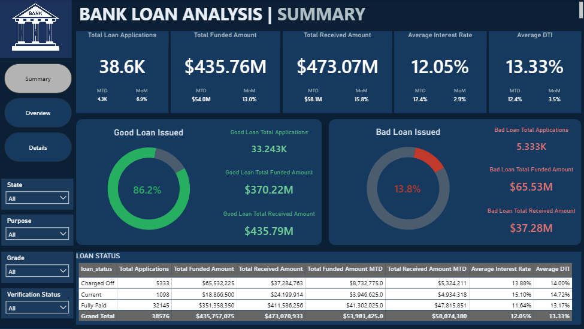
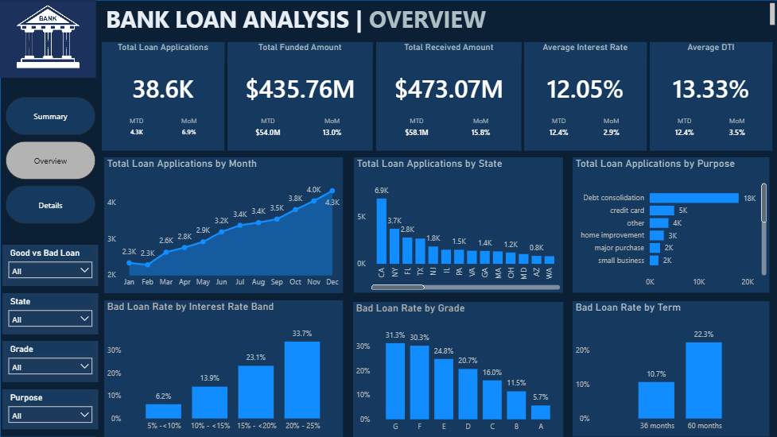
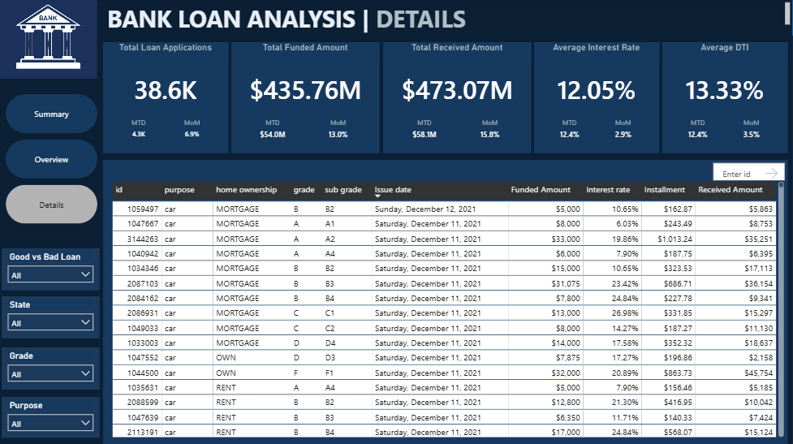

# 📊 Bank Loan Portfolio & Repayment Risk Analysis

## 📌 Project Overview

This project analyses a bank loan portfolio using **Power BI** to understand loan demand, portfolio performance, and patterns associated with repayment risk.

The analysis covers **38,576 loan applications** and examines factors such as interest rate, loan grade, loan term, loan purpose, debt-to-income ratio (DTI), employment length, homeownership, and geographic location.

The goal was to transform raw loan data into an interactive dashboard that provides meaningful insights for **lending strategy, portfolio monitoring, and risk management**.

---

## 🎯 Business Problem

Financial institutions need to understand not only how many loans they issue, but also how those loans perform over time and which segments may present greater repayment risk.

This analysis seeks to answer:

> **What factors are associated with loan performance and repayment risk in the bank's loan portfolio?**

---

## 🎯 Project Objectives

The analysis aims to:

- Measure overall loan application and funding activity.
- Evaluate the proportion of good and bad loans.
- Track loan application trends over time.
- Identify locations and loan purposes with high demand.
- Analyse bad-loan rates across different loan characteristics.
- Identify segments associated with higher repayment risk.
- Provide insights that can support lending and risk-monitoring decisions.

---

## 🗂️ Dataset

**Dataset:** Financial Loan Dataset  
**Records:** 38,576 loan applications  
**Columns:** 24

The dataset contains information relating to:

- Loan status
- Loan amount
- Total payment
- Interest rate
- Debt-to-income ratio
- Loan grade and sub-grade
- Loan term
- Loan purpose
- Homeownership
- Employment length
- Annual income
- State
- Issue and payment dates

---

## 🧹 Data Cleaning & Preparation

The data was prepared using **Power Query** before building the dashboard.

Key preparation steps included:

- Checked for duplicate records and duplicate Loan IDs.
- Reviewed missing values.
- Replaced blank employment-title values with `Not Provided`.
- Removed leading spaces from loan-term values.
- Converted text-based date columns into proper date fields using the appropriate UK date format.
- Reviewed numeric fields for unusual values and potential outliers.
- Created a `Loan_Category` field to classify loans for dashboard analysis.
- Created a dedicated Date Table for time-based analysis.

### Loan Classification

For this project, the dashboard classification was:

- **Good Loan:** Current + Fully Paid
- **Bad Loan:** Charged Off

---

## 🧩 Data Modeling

A dedicated Date Table was created and connected to the loan table through the `issue_date` field.

### 🗓️ Date Table

```DAX
DateTable =
CALENDAR(
    MIN(financial_loan[issue_date]),
    MAX(financial_loan[issue_date])
)

The Date Table includes:
- Year
- Month Number
- Month
- Year Month

The relationship between `DateTable[Date]` and `financial_loan[issue_date]` was used to support time-based analysis.

```
## 🧮 DAX Measures


**Total Applications**
```dax
Total Applications = DISTINCTCOUNT(financial_loan[id])
```

**Total Funded Amount**
```dax
Total Funded Amount = SUM(financial_loan[loan_amount])
```

**Total Received Amount**
```dax
Total Received Amount = SUM(financial_loan[total_payment])
```

**Good Loan Applications**
```dax
Good Loan Applications =
CALCULATE(
    DISTINCTCOUNT(financial_loan[id]),
    financial_loan[Loan_Category] = "Good Loan"
)
```

**Bad Loan Applications**
```dax
Bad Loan Applications =
CALCULATE(
    DISTINCTCOUNT(financial_loan[id]),
    financial_loan[Loan_Category] = "Bad Loan"
)
```

**Bad Loan Rate**
```dax
Bad Loan Rate =
DIVIDE(
    [Bad Loan Applications],
    [Total Applications]
)
```

> The **Bad Loan Rate** measure was particularly important because it allowed risk to be compared across segments based on proportion rather than simply comparing the number of bad loans.

---
## 📈 Dashboard

The Power BI dashboard consists of three pages.

### 1. Summary
The Summary page provides a high-level overview of the loan portfolio.

Key metrics include:
- Total Loan Applications
- Total Funded Amount
- Total Received Amount
- Average Interest Rate
- Average DTI
- Good vs Bad Loan distribution
- Loan Status
- MTD and MoM performance


### 2. Overview
The Overview page focuses on loan demand and repayment risk.

Key visuals include:
- Monthly Loan Applications
- Applications by State
- Applications by Purpose
- Bad Loan Rate by Interest Rate Band
- Bad Loan Rate by Grade
- Bad Loan Rate by Term


### 3. Details
The Details page provides transaction-level information for deeper investigation.

Users can explore:
- Loan ID
- Purpose
- Homeownership
- Grade
- Sub-grade
- Issue Date
- Funded Amount
- Interest Rate
- Installment
- Received Amount

Interactive filters allow users to investigate specific segments of the portfolio.


---
## 📊 Key Portfolio Metrics

| Metric | Value |
|---|---|
| Total Applications | 38,576 |
| Total Funded Amount | $435.76M |
| Total Received Amount | $473.07M |
| Good Loan Rate | 86.2% |
| Bad Loan Rate | 13.8% |

---
## 🔍 Key Findings

### 1. 📈 Loan Demand Increased Throughout the Year
Loan applications increased from 2.3K in January to 4.3K in December, showing a consistent upward trend in loan demand.

**Business implication:** The bank may need to prepare its lending operations and resources to handle increasing application volumes.

### 2. ⚠️ Higher Interest Rates Were Associated With Higher Bad-Loan Rates

| Interest Rate Band | Bad Loan Rate |
|---|---|
| 5% – <10% | 6.2% |
| 10% – <15% | 13.9% |
| 15% – <20% | 23.1% |
| 20% – 25% | 33.7% |

Loans in the 20%–25% interest-rate band recorded a 33.7% bad-loan rate, compared with 6.2% for loans below 10%.

**Business implication:** Higher-interest loans should receive closer risk assessment and monitoring.

*This finding indicates an association and should not be interpreted as proof that higher interest rates directly cause loan defaults.*

### 3. 📅 Longer Loan Terms Showed Higher Repayment Risk
- 36 months: 10.7% bad-loan rate
- 60 months: 22.3% bad-loan rate

The 60-month term recorded more than twice the bad-loan rate of the 36-month term.

**Business implication:** Longer-term loans may require additional risk assessment and monitoring.

### 4. 📊 Lower Loan Grades Showed Higher Repayment Risk
- Grade G: 31.3%
- Grade F: 30.3%

Grades F and G recorded the highest bad-loan rates across the loan grades analysed.

**Business implication:** Lower-grade borrowers may require stronger credit assessment and closer post-loan monitoring.

### 5. 💼 Some Loan Purposes Showed Elevated Risk
- Small Business — 25.6%
- Renewable Energy — 18.1%

**Business implication:** The bank could investigate these loan purposes further to understand the characteristics contributing to their higher observed risk.

### 6. 💳 DTI Showed a Gradual Relationship With Repayment Risk
Bad-loan rates increased from 12.0% among customers with DTI below 10% to 15.9% among customers with DTI between 25% and 30%.

The relationship was noticeable but weaker than the patterns observed for interest rate, grade, and term.

**Business implication:** DTI can contribute to risk assessment but should be considered alongside other indicators.

### 7. 📍 California Recorded the Highest Application Volume
California recorded approximately 6.9K applications, making it the state with the highest loan application volume.

**Business implication:** California represents a major source of loan demand and may deserve closer attention when planning regional lending and marketing strategies.

## 💡 Business Recommendations

Based on the analysis:
- Strengthen risk assessment for higher-risk segments, particularly lower grades and higher-interest loans.
- Monitor longer-term loans closely given their higher observed bad-loan rate.
- Investigate high-risk loan purposes, particularly Small Business lending.
- Use multiple indicators such as grade, interest rate, term, and DTI when evaluating repayment risk.
- Monitor portfolio quality as loan application volumes continue to increase.
- Use regional demand patterns to support resource allocation and lending strategy.

---
## 🛠️ Tools & Skills


**Tools**
- Power BI
- Power Query
- DAX
- Excel
- CSV

**Skills Demonstrated**
- Data Cleaning
- Data Transformation
- Data Modeling
- DAX
- KPI Development
- Time-Series Analysis
- Risk Analysis
- Data Visualization
- Business Intelligence
- Insight Generation
- Business Recommendations

---
## 📌 Project Takeaway

This project demonstrates how raw financial data can be transformed into an interactive business intelligence solution.

The analysis moved through:

**Raw Data → Data Cleaning → Data Modeling → DAX → Dashboard → Risk Analysis → Business Recommendations**

One of the key lessons from this project was that loan volume alone does not tell the complete story. Comparing bad-loan rates across different segments provides a more meaningful view of repayment risk and helps identify areas that may require closer monitoring.


---

## 🖼️ Dashboard Screenshots

### Bank Loan Summary


### Bank Loan Overview 


### Bank Loan Details 


---
## 👩🏽‍💻 About Me

**Victoria Okafor**

Aspiring Data Analyst with a growing portfolio of practical projects focused on turning data into meaningful business insights.

**Skills:** Excel | SQL | Power BI | Python

I am documenting my journey into data analytics by working on real-world datasets and building projects that demonstrate both technical and business-thinking skills.

---
## 📫 Connect With Me

- **LinkedIn:** Add your LinkedIn profile link here
- **GitHub:** Add your GitHub profile link here

---
## ⭐ Project Note

If you found this project useful or interesting, feel free to explore the repository and connect with me.
